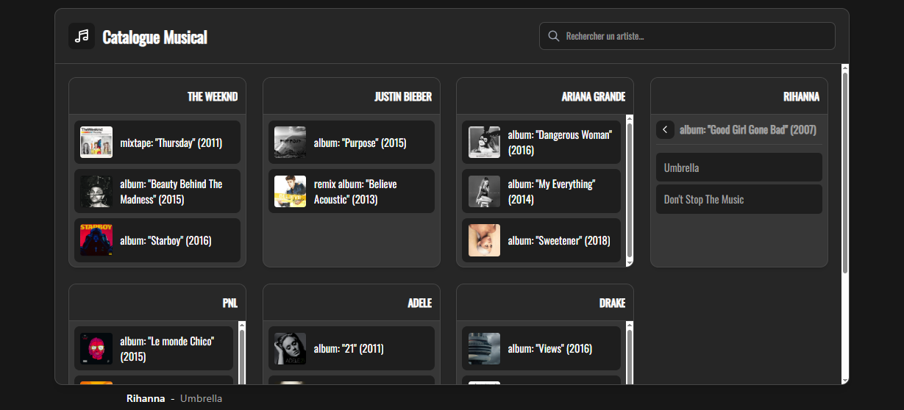
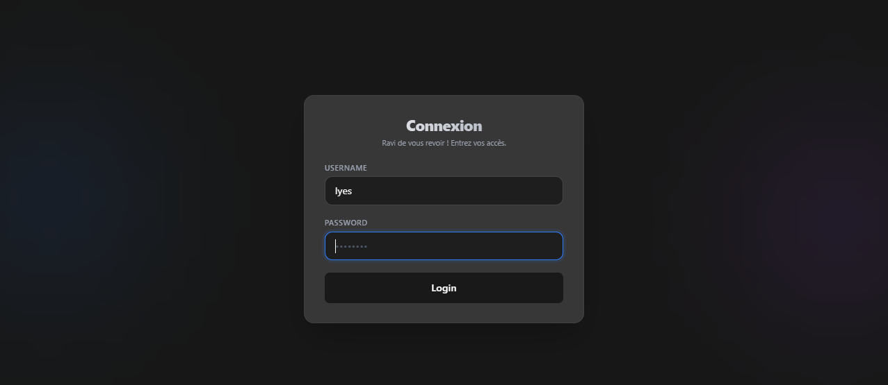
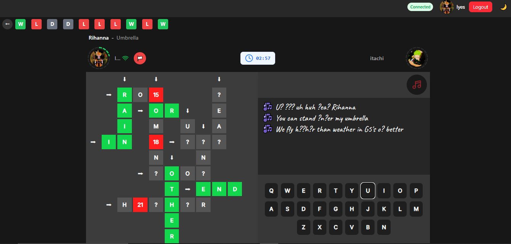
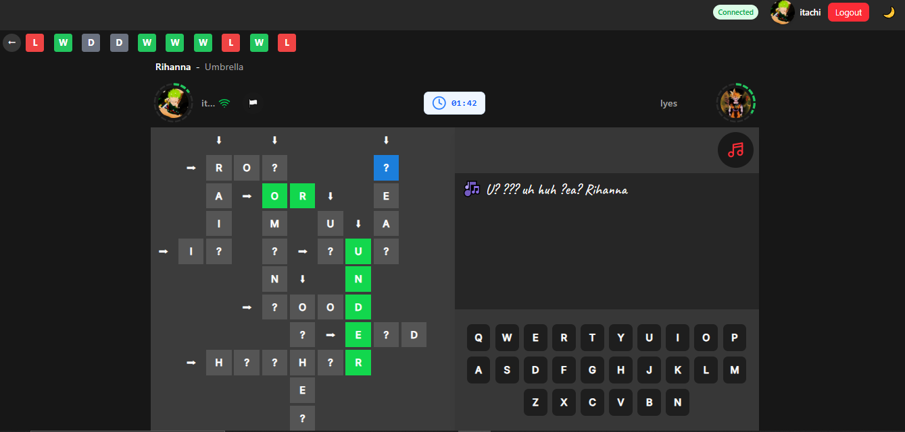
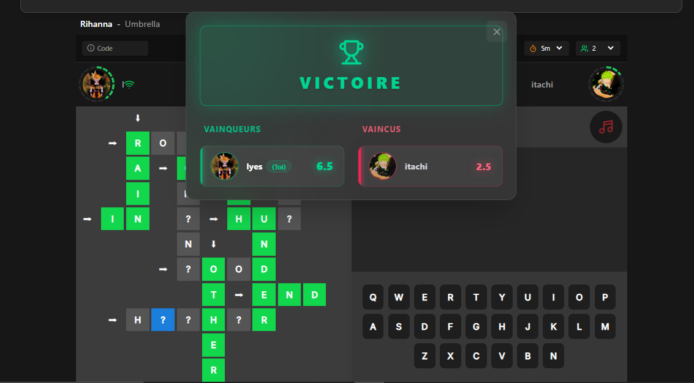
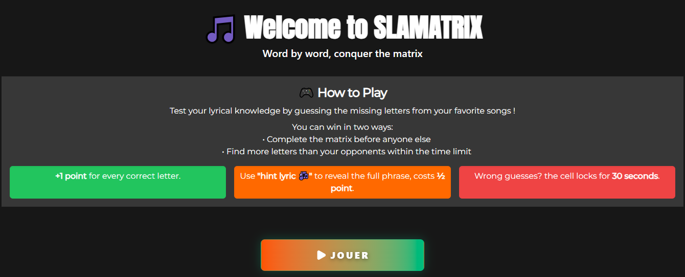

# slamatrix-showcase
Note : Ceci est un dépôt vitrine. Le code source complet est hébergé sur un dépôt privé.

# SLAMATRIX 🎮🎵

Une plateforme de jeu musical interactif où les joueurs devinent des paroles de chansons à travers un système de matrices. Construite avec **React**, **Vite**, **TypeScript** et **TailwindCSS**.

## 🎯 Vue d'ensemble

## 📱 Aperçu de l'application

<p align="center">
  &nbsp;&nbsp;&nbsp;&nbsp;&nbsp;&nbsp;
</p>

<br><br>

<p align="center">
  &nbsp;&nbsp;&nbsp;&nbsp;&nbsp;&nbsp;
</p>

<br><br>

<p align="center">
  &nbsp;&nbsp;&nbsp;&nbsp;&nbsp;&nbsp;
</p>

<br><br>

<p align="center">
  &nbsp;&nbsp;&nbsp;&nbsp;&nbsp;&nbsp;
</p>

<br><br>

<p align="center">
  &nbsp;&nbsp;&nbsp;&nbsp;&nbsp;&nbsp;
</p>

<br><br>

<p align="center">
  &nbsp;&nbsp;&nbsp;&nbsp;&nbsp;&nbsp;
</p>

<br><br>


**SLAMATRIX** (Slamatrice) est une application web qui combine musique et jeux de mots. Les utilisateurs peuvent jouer à "Les Matrices", un jeu où ils doivent retrouver les lettres des paroles de chansons dans une grille, tout en concourant contre d'autres joueurs en temps réel.

### Tagline
> "Word by word, conquer the matrix" 🎮

## ✨ Fonctionnalités principales

### 1. **Authentification et Profils** 👤
- Inscription et connexion utilisateurs
- Profils personnalisés avec avatar
- Gestion sécurisée des tokens (JWT)
- Refresh token automatique
- Intégration **Cloudinary** pour les images de profil

### 2. **Jeu Principal : Les Matrices** 🎮
Un jeu interactif et engageant basé sur :
- **Grille de mots** : Retrouvez les lettres des paroles dans une matrice
- **Musique** : Écoutez la chanson pour trouver les bonnes réponses
- **Système de scoring** : Points basés sur la vitesse et l'exactitude
- **Sélection de cellules** : Interface interactive pour sélectionner les lettres
- **Feedback en temps réel** : Animations et retours visuels

### 3. **Système de Parties** 📊
- **Multijoueur en temps réel** : Affrontez d'autres joueurs
- **Historique des parties** : Consultez vos résultats passés
- **Résultats variés** : Win (victoire), Lose (défaite), CoWin (victoire partagée), Draw (égalité)
- **Code de partie** : Identifiant unique pour chaque jeu
- **Données enrichies** :
  - Titre, artiste, album
  - Temps de jeu
  - Score final
  - Adversaires et résultats

### 4. **Lecteur Musical Intégré** ▶️
- Contrôles standards (play, pause, volume)
- Synchronisation avec le jeu
- Affichage de l'album et metadata
- Interface intuitive

### 5. **Panel Admin** ⚙️
- **Scraper de paroles** : Récupérer les paroles depuis Genius/sources musicales
- **Gestion des chansons** : Ajouter et organiser les chansons
- **Gestion des albums** : Lier les chansons aux albums
- **Gestion des artistes** : Cataloguer les artistes

### 6. **Système de Thème** 🎨
- Mode clair/sombre adaptatif
- Thème personnalisable
- Couleurs cohérentes sur toute l'application
- Basé sur les préférences système

## 📱 Stack Technique

### Frontend
| Aspect | Technologie |
|--------|------------|
| Framework | React 19 |
| Bundler | Vite 6.2.0 |
| Langage | TypeScript 5.9.3 |
| Styling | TailwindCSS 4.0.14 |
| État global | Zustand 5.0.3 |
| Animations | Framer Motion 12.5.0 |
| Routage | React Router DOM 7.2.0 |
| HTTP Client | Axios 1.8.3 |
| Gestion images | Cloudinary |

### Fonctionnalités
- Vite + React Plugin
- TailwindCSS Vite Plugin
- ESLint avec support React
- Support Scrollbar personnalisé

## 🏗️ Architecture

```
src/
├── pages/                          # Pages principales
│   ├── auth/
│   │   ├── inscription.tsx        # Formulaire inscription
│   │   ├── connexion.tsx          # Formulaire connexion
│   │   └── compte.tsx             # Gestion compte
│   ├── home.tsx                   # Accueil
│   ├── player.tsx                 # Lecteur et jeu
│   ├── jeux/
│   │   └── les_matrices/
│   │       ├── les_matrices.tsx   # Jeu principal
│   │       ├── les_matrices.css
│   │       └── utils/
│   └── admin/
│       ├── admin.tsx              # Dashboard admin
│       └── gestion_jeux/
│           └── scrape_lyrics.tsx  # Scraper de paroles
├── services/                       # Services API
│   ├── config.ts                  # Configuration API
│   ├── RequestGateway.ts          # Gestion requêtes
│   └── userAPI/
│       └── api.ts                 # Endpoints utilisateur
├── stores/                         # État global (Zustand)
│   └── useTimerStore.ts           # Timer countdown
├── context/                        # Context API
│   └── userContext.tsx            # Contexte utilisateur
├── hooks/                          # Hooks personnalisés
│   └── useThemeColors.ts          # Gestion thème
├── assets/                         # Assets statiques
│   └── colors.ts                  # Configuration couleurs
├── App.tsx                         # Composant racine
├── main.tsx                        # Point d'entrée
└── navigation.tsx                  # Barre de navigation
```

## 🎮 Flux utilisateur

### Joueur standard
1. ✅ Accéder à l'application
2. ✅ S'inscrire ou se connecter
3. ✅ Voir le profil personnel
4. ✅ Sélectionner une chanson
5. ✅ Jouer au jeu "Les Matrices"
6. ✅ Confronter d'autres joueurs
7. ✅ Consulter l'historique des parties
8. ✅ Voir les scores et statistiques

### Administrateur
1. ✅ Accéder au panel admin
2. ✅ Rechercher des artistes
3. ✅ Scraper les paroles des chansons
4. ✅ Ajouter les chansons à la base de données
5. ✅ Gérer les albums et artistes

## 📡 API Endpoints

### Authentification
```
POST   /signup                    # Inscription
POST   /login                     # Connexion
GET    /refresh-token             # Rafraîchir le token
```

### Utilisateur
```
GET    /get-user-data             # Données utilisateur
```

### Contenu Musical
```
GET    /get-artist-content        # Récupérer albums d'un artiste
GET    /get-song-lyrics           # Récupérer paroles d'une chanson
POST   /add-song                  # Ajouter une chanson
```

### Configuration API
- **Base URL** : `https://slamatrice-server.onrender.com/api`
- Configurable via [src/services/config.ts](src/services/config.ts)
- Support du développement local (localhost:3000)

## 🔐 Sécurité

- ✅ Authentification par Bearer Token (JWT)
- ✅ Refresh Token automatique à l'expiration
- ✅ Stockage sécurisé des tokens (SessionStorage)
- ✅ Gestion centralisée des requêtes HTTP
- ✅ Gestion d'erreurs unifiée (403 auto-refresh)

## 🎨 Thème et Couleurs

### Variables CSS personnalisées
```css
--primaryColor          /* Couleur principale */
--backgroundColor       /* Fond */
--backgroundCard        /* Fond des cartes */
--backgroundButton      /* Boutons */
--backgroundButtonHover /* État hover boutons */
--textWhite            /* Texte blanc */
--textGray             /* Texte gris */
--borderInput          /* Border des inputs */
--backgroundInput      /* Fond des inputs */
```

### Mode sombre
- Activé automatiquement
- Basé sur la classe CSS `dark`
- Couleurs optimisées pour confort visuel

## 🚀 Installation et Setup

### Prérequis
- Node.js (v16+)
- npm ou pnpm

### Installation
```bash
# Installer les dépendances
npm install
# ou
pnpm install
```

### Développement

**Lancer le serveur de développement** :
```bash
npm run dev
```

L'application est disponible à `http://localhost:5173`

### Build pour la production
```bash
npm run build
```

### Preview de la build
```bash
npm run preview
```

### Linting
```bash
npm run lint
```

## 📦 Dépendances principales

```json
{
  "react": "^19.0.0",
  "react-dom": "^19.0.0",
  "react-router-dom": "^7.2.0",
  "typescript": "^5.9.3",
  "vite": "^6.2.0",
  "@vitejs/plugin-react": "^4.3.4",
  "tailwindcss": "^4.0.14",
  "@tailwindcss/vite": "^4.0.14",
  "zustand": "^5.0.3",
  "framer-motion": "^12.5.0",
  "axios": "^1.8.3",
  "@cloudinary/react": "^1.14.3",
  "react-router-dom": "^7.2.0",
  "clsx": "^2.1.1"
}
```

## 🛠️ Commandes disponibles

```bash
npm run dev              # Lancer le serveur de développement
npm run build            # Construire pour la production
npm run preview          # Prévisualiser la build
npm run lint             # Vérifier le code avec ESLint
```

## 🎯 Types de données principaux

### User
```typescript
{
  username: string;
  email: string;
  url: string;          // Avatar Cloudinary
  parties: Party[];     // Historique des parties
}
```

### Party (Partie)
```typescript
{
  startTime: Date;
  endTime: string;
  code: string;           // Identifiant unique
  countdown: number;
  idTitle: {
    artistName: string;
    albumName: string;
    title: string;
  };
  surrender: boolean;
  result: 'win' | 'lose' | 'coWin' | 'draw';
  opponents: Opponent[];
}
```

### Song (Chanson)
```typescript
{
  title: string;
  artist: string;
  album: string;
  lyrics: string;
  imageUrl: string;     // Album art
}
```

### GameState
```typescript
{
  localGameRoom?: any;
  players: Record<string, PlayerState>;
  gameStarted: boolean;
  countdown?: number;
  selectedCell?: [number, number];
  selectedWord?: string;
}
```

## 🎮 Mécanique du Jeu

### Les Matrices - Comment ça marche ?

1. **Grille** : Une matrice de lettres s'affiche
2. **Paroles** : Une chanson joue
3. **Objectif** : Trouver les lettres des paroles dans la grille
4. **Sélection** : Cliquez sur les cellules de la grille pour sélectionner les lettres
5. **Scoring** : Points basés sur :
   - Exactitude des réponses
   - Vitesse de jeu
   - Nombre de joueurs défaits
6. **Résultats** : Victoire, défaite, égalité ou victoire partagée

### Système de Timer
- Countdown avant le début du jeu
- Temps limite par partie
- Notification lors de l'expiration

## 🎬 Animations et Interactions

- **Framer Motion** pour les animations fluides
- Transitions entre écrans
- Feedback utilisateur en temps réel
- Hover effects sur les boutons

## 🌐 Intégrations

### Cloudinary
- Stockage des avatars utilisateurs
- Gestion optimisée des images
- CDN global pour rapidité

### Genius/Lyrics Sources
- Scraping automatique des paroles
- Gestion des artistes et albums
- Stockage en base de données

## 📊 Statistiques et Historique

- Partie jouée avec timestamp
- Résultats et score final
- Liste des adversaires
- Durée de la partie
- Cancellation/abandon possible

## 🐛 Debugging

L'application inclut :
- Logs détaillés en console
- Gestion des erreurs réseau
- Validation des données
- Messages d'erreur clairs

## 📱 Responsive Design

- Optimisée pour desktop
- Layout adaptatif TailwindCSS
- Support de tous les navigateurs modernes

## 🔄 State Management

### Zustand (useTimerStore)
- Gestion centralisée du countdown
- État global simple et performant

### Context API (UserContext)
- Contexte utilisateur global
- Disponible dans toute l'application

## 🎓 Ressources

- [Vite Documentation](https://vitejs.dev/)
- [React Documentation](https://react.dev/)
- [TypeScript Guide](https://www.typescriptlang.org/)
- [TailwindCSS](https://tailwindcss.com/)
- [Zustand](https://github.com/pmndrs/zustand)
- [Framer Motion](https://www.framer.com/motion/)
- [React Router](https://reactrouter.com/)
- [Cloudinary](https://cloudinary.com/)

## 📄 Licence

Projet privé.

## 👥 Auteur

Projet personnel SLAMATRIX

---

## 💡 Notes de développement

- Architecture modulaire et scalable
- Séparation claire entre services, pages et composants
- TypeScript pour la sécurité des types
- Vite pour un build et développement ultra-rapide
- ESLint pour la qualité du code
- Support complet du mode sombre

## 🚀 Améliorations futures

- Classement global des joueurs
- Système de achievements/badges
- Mode multijoueur en temps réel (WebSocket)
- Différents niveaux de difficulté
- Intégration Spotify
- Chat en jeu
- Système de guildes/équipes
